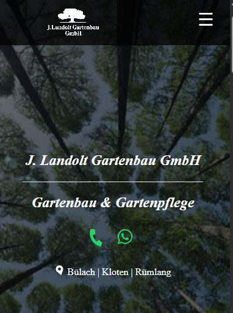

# J. Landolt Gartenbau GmbH – Onepager Website
🌿 Ihr Gärtner für kreative Gartengestaltung
Willkommen bei der Onepager-Website von J. Landolt Gartenbau GmbH – Ihrem Experten für Gartenbau, Gartenpflege und Natursteinarbeiten in Winkel und Umgebung. Diese Website dient als übersichtliche Präsentation unserer Dienstleistungen und erleichtert die Kontaktaufnahme für interessierte Kunden.

www.gartenbaulandolt.ch

📌 Projektbeschreibung
Dies ist eine Onepager-Website, die alle wichtigen Informationen kompakt und elegant auf einer einzigen Seite darstellt. Das moderne und minimalistische Design sorgt für eine übersichtliche Navigation und ermöglicht es Besuchern, sich schnell über unser Angebot zu informieren.

🌱 Hauptmerkmale
✔️ Strukturiertes Design – Alle Inhalte befinden sich auf einer einzigen Seite für eine nahtlose Nutzererfahrung. ✔️ Klare Servicebereiche – Gartenpflege, Gartenbau und Natursteinarbeiten mit detaillierter Beschreibung. ✔️ Bildergalerie – Anschauliche Bilder unserer Arbeiten zur Inspiration für Kunden. ✔️ Kontaktformular – Direkte Kontaktmöglichkeit mit automatischer Anfrageoption. ✔️ Mobilfreundlich – Optimierte Darstellung für alle Bildschirmgrößen

🚀 Technologien & Tools
React & Vite – Schnelle, moderne Webentwicklung

TypeScript – Typensicherheit und bessere Code-Struktur

CSS (Styled Components) – Elegante und flexible Designanpassungen

Basin / Formspree – Kontaktformular für direkte Anfragen